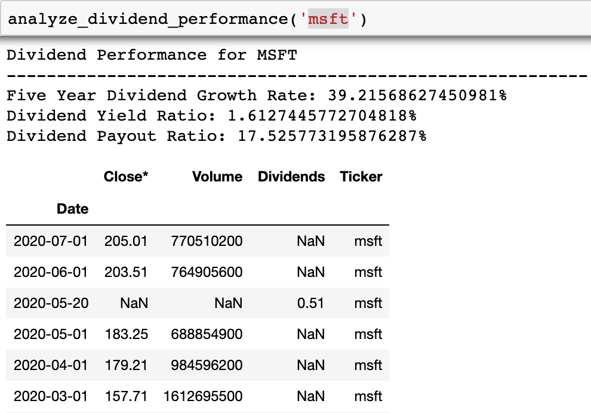

# Stock-Dividend-Analysis
## Purpose
The purpose of this project is to create a streamlined method of analyzing a stock's dividend performance. 
## Data Sources
- Yahoo! (historic stock prices and dividend payment data)
- MarketWatch (financial statement information)
## Ratios 
- Five Year Dividend Growth Rate
- Dividend Yield Ratio
- Dividend Payout Ratio
## Result Example (Microsoft)
The final result takes in a stock ticker (msft for this example) and outputs the Fiver Year Dividend Growth Rate, Dividend Yield Ratio and Dividend Payout Ratio as well as a DataFrame going back five years that includes the closing price on the first of each month, outstanding shares of stock, dividend payments per share, and the stock ticker for reference.  
(The dates that contain stock price information with have NaN for Dividends and the dates that contain Dividends will have NaN for Close Price and Volume)
 

